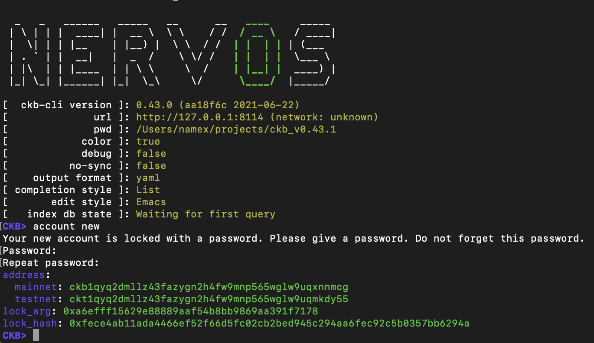
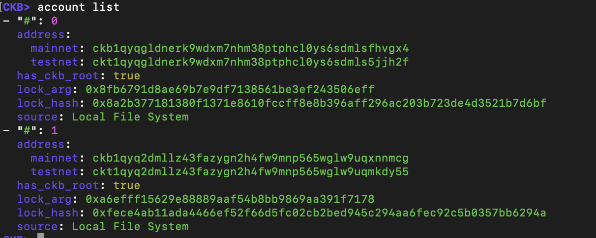
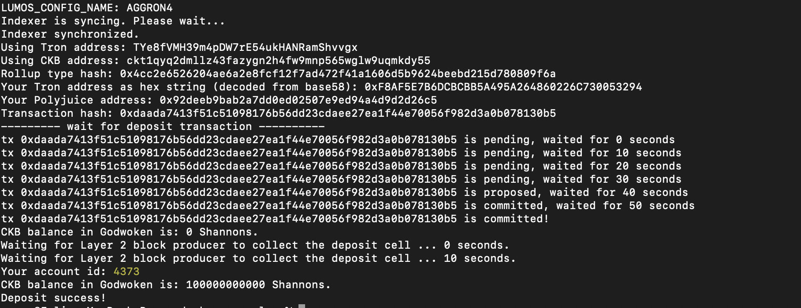
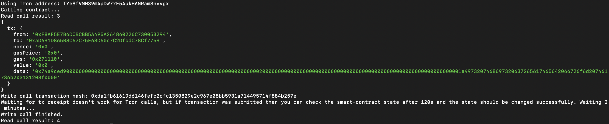

# nervos-hack-task-11

Here the task submission files and infos for the nervos hackaton task 11 :

- A screenshot of the accounts you created (account list) in ckb-cli.



- A link to the Layer 1 address you funded on the Testnet Explorer.
https://explorer.nervos.org/aggron/address/ckt1qyq2dmllz43fazygn2h4fw9mnp565wglw9uqmkdy55

- A screenshot of the console output immediately after you have successfully submitted a CKByte deposit to your Tron account on Layer 2.


- A screenshot of the console output immediately after you have successfully issued a smart contract calls on Layer 2.


- The transaction hash of the "Contract call" from the console output (in text format): 0xda1fb61619d6146fefc2cfc1350829e2c967e08bb5931a714495714f884b257e

- The contract address that you called (in text format): 0xaD691D865B8C67C75E63D60c7C2DfcdC78Cf7759

- The ABI for contract you made a call on (in text format).

```
[
  {
    "inputs": [],
    "stateMutability": "nonpayable",
    "type": "constructor"
  },
  {
    "anonymous": false,
    "inputs": [
      {
        "indexed": true,
        "internalType": "uint256",
        "name": "id",
        "type": "uint256"
      },
      {
        "indexed": true,
        "internalType": "address",
        "name": "creator",
        "type": "address"
      }
    ],
    "name": "PollCreated",
    "type": "event"
  },
  {
    "inputs": [],
    "name": "pollCount",
    "outputs": [
      {
        "internalType": "uint256",
        "name": "",
        "type": "uint256"
      }
    ],
    "stateMutability": "view",
    "type": "function",
    "constant": true
  },
  {
    "inputs": [
      {
        "internalType": "uint256",
        "name": "",
        "type": "uint256"
      }
    ],
    "name": "polls",
    "outputs": [
      {
        "internalType": "uint256",
        "name": "id",
        "type": "uint256"
      },
      {
        "internalType": "uint256",
        "name": "creationTime",
        "type": "uint256"
      },
      {
        "internalType": "string",
        "name": "question",
        "type": "string"
      },
      {
        "internalType": "address",
        "name": "creator",
        "type": "address"
      }
    ],
    "stateMutability": "view",
    "type": "function",
    "constant": true
  },
  {
    "inputs": [
      {
        "internalType": "string",
        "name": "question",
        "type": "string"
      }
    ],
    "name": "createPoll",
    "outputs": [
      {
        "internalType": "uint256",
        "name": "pollID",
        "type": "uint256"
      }
    ],
    "stateMutability": "payable",
    "type": "function",
    "payable": true
  }
]
```

- Your Tron address (in text format): TYe8fVMH39m4pDW7rE54ukHANRamShvvgx